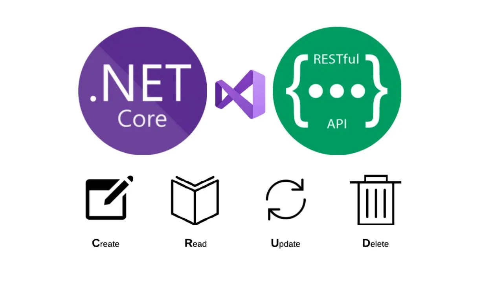

# ProductosMongoRestNet

Ejemplo de una API REST básica en .NET Core 8 y MongoDB

- [ProductosMongoRestNet](#productosmongorestnet)
  - [Descripción](#descripción)
  - [Librerías usadas](#librerías-usadas)

## Descripción

Este proyecto es un ejemplo de una API REST básica en .NET Core 8 con MongoDB.

Cuidado con las configuraciones y la inyección de los servicios

Mongo esta en Mongo Atlas, por lo que la cadena de conexión es un poco diferente.

## Librerías usadas
- MongoDB.Driver